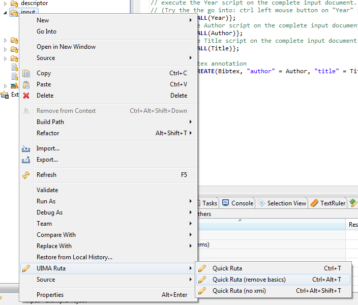

// Licensed to the Apache Software Foundation (ASF) under one
// or more contributor license agreements. See the NOTICE file
// distributed with this work for additional information
// regarding copyright ownership. The ASF licenses this file
// to you under the Apache License, Version 2.0 (the
// "License"); you may not use this file except in compliance
// with the License. You may obtain a copy of the License at
//
// http://www.apache.org/licenses/LICENSE-2.0
//
// Unless required by applicable law or agreed to in writing,
// software distributed under the License is distributed on an
// "AS IS" BASIS, WITHOUT WARRANTIES OR CONDITIONS OF ANY
// KIND, either express or implied. See the License for the
// specific language governing permissions and limitations
// under the License.

[[_ugr.tools.ruta.workbench]]
= Apache UIMA Ruta Workbench

The Apache UIMA Ruta Workbench, which is made available as an Eclipse-plugin, offers a powerful environment for creating and working on UIMA Ruta projects.
It provides two main perspectives and several views to develop, run, debug, test and evaluate UIMA Ruta rules in a comfortable way, supporting many of the known Eclipse features, e.g., auto-completion.
Moreover, it makes the creation of dictionaries like tree word lists easy and supports machine learning methods, which can be used within a knowledge engineering process.
The following chapter starts with the installation of the workbench, followed by a description of all its features. 

include::tools.ruta.workbench.install.adoc[leveloffset=+1]

include::tools.ruta.workbench.overview.adoc[leveloffset=+1]

include::tools.ruta.workbench.projects.adoc[leveloffset=+1]

include::tools.ruta.workbench.ruta_perspective.adoc[leveloffset=+1]

include::tools.ruta.workbench.explain_perspective.adoc[leveloffset=+1]

include::tools.ruta.workbench.cde.adoc[leveloffset=+1]

include::tools.ruta.workbench.query.adoc[leveloffset=+1]

include::tools.ruta.workbench.testing.adoc[leveloffset=+1]

include::tools.ruta.workbench.textruler.adoc[leveloffset=+1]

include::tools.ruta.workbench.check.adoc[leveloffset=+1]

include::tools.ruta.workbench.create_dictionaries.adoc[leveloffset=+1]

[[_ugr.tools.ruta.workbench.apply]]
== Apply a UIMA Ruta script to a folder

The UIMA Ruta Workbench makes it possible to apply a UIMA Ruta script to any folder of the workspace.
Select a folder in the script explorer, right-click to open the context menu and select the menu entry UIMA Ruta.
There are three options to apply a UIMA Ruta script to the files of the selected folder, cf. <<_figure.ugr.tools.ruta.workbench.apply>>. 

. *Quick Ruta* applies the UIMA Ruta script that is currently opened and focused in the UIMA Ruta editor to all suitable files in the selected folder. Files of the type "`xmi`" will be adapted  and a new xmi-file will be created for other files like txt-files. 
. *Quick Ruta (remove basics)* is very similar to the previous menu entry, but removes the annotations of the type "`RutaBasic`" after processing a CAS. 
. *Quick Ruta (no xmi)* applies the UIMA Ruta script, but does not change nor create an xmi-file. This menu entry can, for example, be used in combination with an imported XMIWriter Analysis Engine, which  stores the result of the script in a different folder depending on the execution of the rules. 

[[_figure.ugr.tools.ruta.workbench.apply]]
.Remove Ruta basics 

