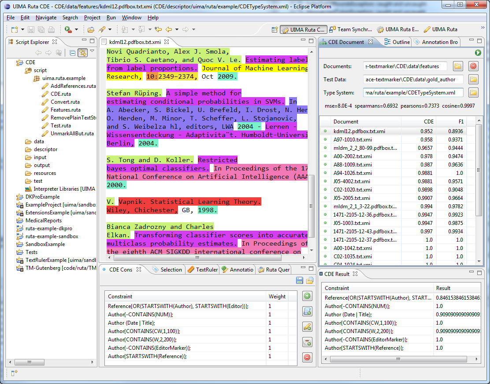

// Licensed to the Apache Software Foundation (ASF) under one
// or more contributor license agreements. See the NOTICE file
// distributed with this work for additional information
// regarding copyright ownership. The ASF licenses this file
// to you under the Apache License, Version 2.0 (the
// "License"); you may not use this file except in compliance
// with the License. You may obtain a copy of the License at
//
// http://www.apache.org/licenses/LICENSE-2.0
//
// Unless required by applicable law or agreed to in writing,
// software distributed under the License is distributed on an
// "AS IS" BASIS, WITHOUT WARRANTIES OR CONDITIONS OF ANY
// KIND, either express or implied. See the License for the
// specific language governing permissions and limitations
// under the License.

[[_section.tools.ruta.workbench.cde]]
= UIMA Ruta CDE perspective

The UIMA Ruta CDE (Constraint-Driven Evaluation) provides some views and functionality to investigate and evaluate a set of annotated documents using domain and background knowledge formalized as constraints and UIMA Ruta rules. <<_figure.tools.ruta.workbench.cde>> provides an overview of the perspective.
Its views are described in the following. 

[[_figure.tools.ruta.workbench.cde]]
.The UIMA Ruta cde framework 

[[_section.tools.ruta.workbench.cde.documents]]
== CDE Documents view

This view provides the general functionality to specify, which set of documents should be evaluated.
The green start button in the toolbar  starts the evaluation process with the given configuration specified in the different views.
The text field "`Documents`" specifies the set of documents that have been annotated by an arbitrary model or set of rules.
These xmiCAS documents can contain additional annotations, which are used by the simple rule-based constraints.
The text field "`Test Data`" specifies an optional folder with gold standard documents.
These documents can be applied for comparing the resulting CDE value to an F1 score.
The text field "`Type System`" refers to a type system descriptor, which defines all types that are needed for the evaluation.
Each text field is sensitive to drag and drop.
The use can select a folder in the script explorer and drag and drop it on the text field.
Directly below the text fields, the values of different evaluation measures are given comparing the resulting CDE value to the F1 score.
These values are of course only available, if annotated gold standard data is specified in the text field "`Test Data`". 

The table at the bottom of the view contains all documents that are inspected.
The intervals specifying the color of the icon of each documents dependent of the CDE result can be set in the preference page.
If the evaluation has finished, then the CDE value is displayed and additionally the F1 score, if available.
The table is sortable.
A double-click on a documents opens it in the CAS Editor. 

[[_section.tools.ruta.workbench.cde.constraints]]
== CDE Constraints view

This view specifies the currently applied constraints and their weights.
This list is used to calculate the overall CDE value of one document: the average of the weighted sum.
The buttons in the toolbar of the view export and import the constraint using a simple xml format.
The buttons in the right part of the view can modify the list of the constraints.
Currently, three types of constraints are supported:  Simple UIMA Ruta rules, a list of simple UIMA Ruta rules and word distribution constraints.
All constraints return a value between 0 and 1.
The constraints based on UIMA Ruta rules return the ratio how often the rule was applied to how often the rules tried to apply.
The rule "`Author{STARTSWITH(Reference)};`", for example, returns 1, if all author annotations start with a reference annotation.
The word distribution  constraints refer to a txt file in which each line has the format "`"Proceedings":Booktitle 0.95, Journal 0.05`" specifying the distribution of the word proceedings concerning the interesting annotations.
If no quotes are given for the first term, then the term is interpreted as an annotation type.
The result value is currently calculated by using the cosine similarity of the expected and observed frequencies. 

[[_section.tools.ruta.workbench.cde.result]]
== CDE Result view

The result view displays the result values of each constraint for the document that is selected in the CDE Documents view. 