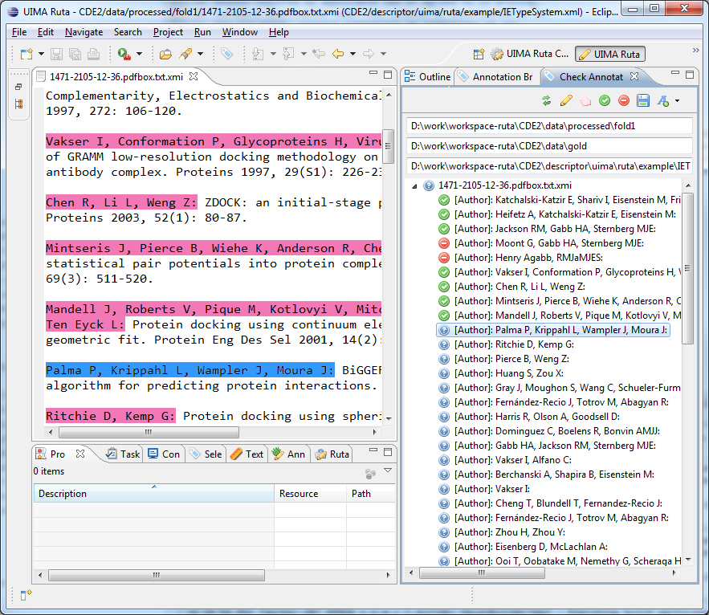

// Licensed to the Apache Software Foundation (ASF) under one
// or more contributor license agreements. See the NOTICE file
// distributed with this work for additional information
// regarding copyright ownership. The ASF licenses this file
// to you under the Apache License, Version 2.0 (the
// "License"); you may not use this file except in compliance
// with the License. You may obtain a copy of the License at
//
// http://www.apache.org/licenses/LICENSE-2.0
//
// Unless required by applicable law or agreed to in writing,
// software distributed under the License is distributed on an
// "AS IS" BASIS, WITHOUT WARRANTIES OR CONDITIONS OF ANY
// KIND, either express or implied. See the License for the
// specific language governing permissions and limitations
// under the License.

[[_section.tools.ruta.workbench.check]]
= Check Annotations view

The Check Annotations view provides functionality to quickly validate a set of annotations in different documents.
The user can specify two folders with xmiCAS files: One folder contains the documents with annotations that should be validated.
The other folder is used to store the validated annotations.
The view enables a rapid navigation between the documents and their annotations  of the selected types can easily be accepted or rejected. <<_figure.tools.ruta.workbench.check>> provides an screenshot of the view.
Its parts are described in the following. 

[[_figure.tools.ruta.workbench.check]]
.Check Annotations view (right part) 

The view provides three text fields: the absolute location of the folder with the source documents, which contain the annotations to be validated,  the absolute location of the gold folder, where the accepted annotations will be stored, and the absolute location of the type system that contains  all necessary types.
The toolbar of the view provides seven buttons: the first one updates the set of documents and  their annotations in the main part of the view.
This is necessary, e.g., if the selected types change or if the annotations in the documents change.
The second button opens a dialog for choosing the types that need to be checked.
Only annotations of those types will be displayed and can be accepted or rejected.
If features need to be checked together with the annotations of a type, these features have to be selected in this dialog too.
Features are shown as sub-nodes of the annotation nodes.
By default, only annotations that have been checked are transferred from the original document to the according gold document.
To also transfer  annotations of some type unchecked, these types have to be chosen in another dialog, which is opened with the third button.
The fourth and fifth button accept/reject the currently selected annotation.
Only accepted annotations will be stored in the gold folder.
An annotation can also  be accepted with the key binding "`ctrl+4`" and rejected with the key binding "`ctrl+5`".
If an annotation is processed,  then the next annotation is automatically selected and a new CAS Editor is opened if necessary.
The sixth button adds the currently accepted annotations, as well as the annotations of a type selected in the unchecked dialog, to the corresponding file in the gold folder and additionally extends an file "`data.xml`", which remembers what types have already been checked in each documents.
Annotations of these types will not show up again in the main part of the view.
With the last button, the user can select the annotation mode of the CAS editor.
The choice is restricted to the currently selected types.
If an annotation is missing in the source documents, then the user can manually add this annotation in the CAS Editor.
The new annotation will be added as accepted to the list of annotations in the main part of the view.
By right-clicking on an annotation node in the view's tree viewer, a dialog opens to change the type of an annotation.
Right-clicking on a feature node opens another dialog to change the feature's value. 