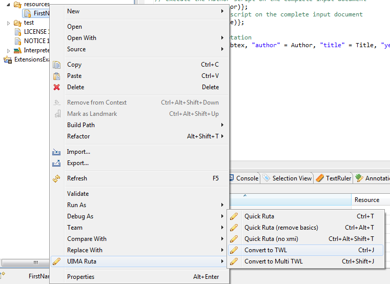

// Licensed to the Apache Software Foundation (ASF) under one
// or more contributor license agreements. See the NOTICE file
// distributed with this work for additional information
// regarding copyright ownership. The ASF licenses this file
// to you under the Apache License, Version 2.0 (the
// "License"); you may not use this file except in compliance
// with the License. You may obtain a copy of the License at
//
// http://www.apache.org/licenses/LICENSE-2.0
//
// Unless required by applicable law or agreed to in writing,
// software distributed under the License is distributed on an
// "AS IS" BASIS, WITHOUT WARRANTIES OR CONDITIONS OF ANY
// KIND, either express or implied. See the License for the
// specific language governing permissions and limitations
// under the License.

[[_section.ugr.tools.ruta.workbench.create_dictionaries]]
= Creation of Tree Word Lists

Tree word lists are external resources, which can be used to annotate all occurrences of list items in a document with a given annotation type, very fast.
For more details on their use, see <<_ugr.tools.ruta.language.external_resources>>.
Since simple tree and multi tree word lists have to be compiled the UIMA Ruta Workbench provides an easy way to compile them from ordinary text files.
These text files have to containing one item per line, for example, like in the following list of first names: 

[source]
----
Frank
Peter
Jochen
Martin
----

To compile a simple tree word list from a text file, right-click on the text file in UIMA Ruta script explorer.
The resulting menu is shown in <<_figure.ugr.tools.ruta.workbench.create_dictionaries_1>>. 

[[_figure.ugr.tools.ruta.workbench.create_dictionaries_1]]
.Create a simple tree word list 

When hovering over UIMA Ruta item you can choose "`Convert to TWL`".
Click on it and a tree word list with the same name as the original file is generated in the same folder. 

You can also generate several tree word lists at once.
To do so, just select multiple files and then right-click and do the same like for a single list.
You will get one tree word list for every selected file. 

To generate a multi tree work list, select all files, which should be generated into the multi tree word list.
Again right-click and select "`Convert to Multi TWL`" under item UIMA Ruta.
A multi tree word list named "`generated.mtwl`" will be created. 

The preferences page provides the option to remove white spaces when generating the word lists. 