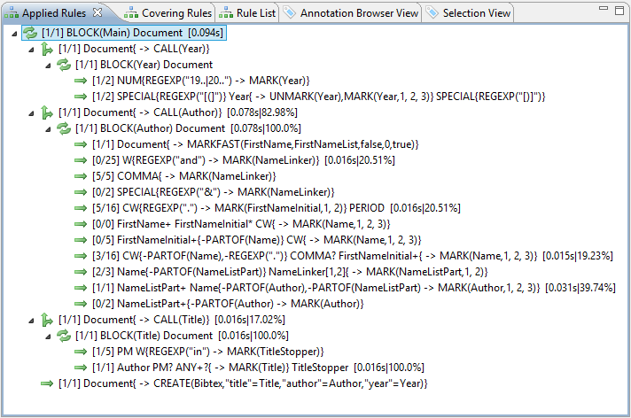
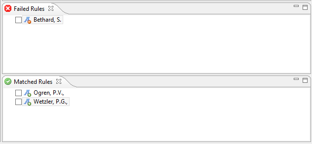
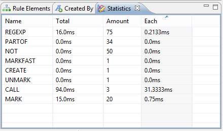

// Licensed to the Apache Software Foundation (ASF) under one
// or more contributor license agreements. See the NOTICE file
// distributed with this work for additional information
// regarding copyright ownership. The ASF licenses this file
// to you under the Apache License, Version 2.0 (the
// "License"); you may not use this file except in compliance
// with the License. You may obtain a copy of the License at
//
// http://www.apache.org/licenses/LICENSE-2.0
//
// Unless required by applicable law or agreed to in writing,
// software distributed under the License is distributed on an
// "AS IS" BASIS, WITHOUT WARRANTIES OR CONDITIONS OF ANY
// KIND, either express or implied. See the License for the
// specific language governing permissions and limitations
// under the License.

[[_section.ugr.tools.ruta.workbench.explain_perspective]]
= UIMA Ruta Explain Perspective

Writing new rules is laborious, especially if the newly written rules do not behave as expected.
The UIMA Ruta system is able to record the application of each single rule and block in order to provide an explanation of the rule inference and a minimal debugging functionality.
The information about the application of the rules itself is stored in the resulting xmiCAS output file, if the parameters of the executed engine are configured correctly.
The simplest way to generate these explanation information is to click on the common 'Debug' button (looks like a green bug) while having the UIMA Ruta script file you want to debug active in your editor.
The current UIMA Ruta file will then be executed on the text files in the input directory and xmiCAS are created in the output directory containing the additional UIMA feature structures describing the rule inference.
To show the newly created execution information, you can either open the Explain perspective or open the necessary views separately and arrange them as you like.
There are eight views that display information about the execution of the rules: Applied Rules, Covering Rules, Created By, Failed Rules, Matched Rules, Rule Elements, Rule List and Statistics.
All of theses views are further explained in detail, using the UIMA Ruta example project for examples. 

To make it possible to reproduce all of the examples used below, switch to the UIMA Ruta Explain perspective within your Eclipse workbench.
Import the UIMA Ruta example project and open the main Ruta script file 'Main.ruta'. Now press the 'Debug' button and wait for the end of execution.
Open the resulting xmiCAS file 'Test1.txt.xmi', which you can find in the output folder. 

[[_section.ugr.tools.ruta.workbench.explain_perspective.applied_rules]]
== Applied Rules

The Applied Rules view displays structured information about all rules that tried to apply to the input documents. 

The structure is as follows: if BLOCK constructs were used in the executed Ruta file, the rules contained in that block will be represented as child node in the tree of the view.
Each Ruta file is a BLOCK construct itself and named after the file.
The root node of the view is, therefore, always a BLOCK containing the rules of the executed UIMA Ruta script.
Additionally, if a rule calls a different Ruta file, then the root block of that file is the child of the calling rule. 

If you double-click on one of the rules, the related script file is opened within the editor and the rule itself is selected. 

<<_section.ugr.tools.ruta.workbench.explain_perspective>> shows the whole rule hierarchy resulting from the UIMA Ruta example project.
The root of the whole hierarchy is the BLOCK associated to the 'Main.ruta' script.
On the next level, the rules called by the 'Main.ruta' script are listed.
Since there is a call to each of the script files 'Year.ruta', 'Author.ruta' and 'Title.ruta', these are included into the hierarchy, each forming their own block. 

The following image shows the UIMA Ruta Applied Rules view. 

. Applied Rules view 

Besides the hierarchy, the view shows how often a rule tried to match in total and how often it succeeded.
This is shown in brackets at the beginning of each rule entry.
The Applied Rules view tells us that the rule `NUM{REGEXP("19..|20..") -> MARK(Year)};` within script 'Year.ruta' tried to match twice but only succeeded once. 

After this information, the rule itself is given.
Notice that each rule is given with all the parameters it has been executed.
Have a look at rule entry `[1/1]Document{->MARKFAST(FirstName,FirstNameList,false,0,true)} ` within BLOCK Author.
The rule obviously has been executed with five parameters.
If you double-click on this rule, you will get to the rule in the script file 'Author.ruta'. It shows the rule as follows: ``Document{-> MARKFAST(FirstName, FirstNameList)};``.
This means the last three parameters have been default values used to execute the rule. 

Additionally, some profiling information, giving details about the absolute time and the percentage of total execution time the rule needed, is added at the end of each rule entry. 

The selection (single-click) of a rule in this view will directly change the information visualized in the views Failed Rules and Matched Rules. 

[[_section.ugr.tools.ruta.workbench.explain_perspective.matched_and_failed_rules]]
== Matched Rules and Failed Rules

If a rule is selected (single-click) in the Applied Rules view, then the Matched Rules view displays all instances (text passages) on which the rule matched.
On the contrary, the Failed Rules view shows the instances on which the rule tried but failed to match. 

Select rule `[2/3]Name{-PARTOF(NameListPart)} NameLinker[1,2]{-> MARK(NameListPart,1,2)};` within BLOCK Author. <<_figure.ugr.tools.ruta.workbench.explain_perspective.matched_and_failed_rules>> shows the text passages this rule tried to match on.
One did not succeed.
It is displayed within the Failed Rules view.
Two succeeded and are shown in the Matched Rules view. 

The following image shows the UIMA Ruta Applied Rules view. 

[[_figure.ugr.tools.ruta.workbench.explain_perspective.matched_and_failed_rules]]
. The views Matched Rules and Failed Rules 

The selection (single-click) of one of the text passages in either Matched Rules view or Failed Rules view will directly change the information visualized in the Rule Elements view. 

[[_section.ugr.tools.ruta.workbench.explain_perspective.rule_elements]]
== Rule Elements

If you select one of the listed instances in the Matched or Failed Rules view, then the Rule Elements view contains a listing of the rule elements and their conditions belonging to the related rule used on the specific text passage.
There is detailed information available on what text passage each rule element did or did not match and which condition did or did not evaluate true. 

Within the Rule Elements view, each rule element generates its own explanation hierarchy.
On the root level, the rule element itself is given.
An apostrophe at the beginning of the rule element indicates that this rule was the anchor for the rule execution.
On the next level, the text passage on which the rule element tried to match on is given.
The last level explains, why the rule element did or did not match.
The first entry on this level tells, if the text passage is of the requested annotation type.
If it is, a green hook is shown in front of the requested type.
Otherwise, a red cross is shown.
In the following the rule conditions and their evaluation on the given text passage are shown. 

In the previous example, select the listed instance ``Bethard, S.``.
The Rule Elements view shows the related explanation displayed in <<_figure.ugr.tools.ruta.workbench.explain_perspective.rule_elements>>. 

The following image shows the UIMA Ruta Rule Elements view. 

[[_figure.ugr.tools.ruta.workbench.explain_perspective.rule_elements]]
.The views Matched Rules and Failed Rules 

As you can see, the first rule element `Name{-PARTOF(NameListPart)}` matched on the text passage `Bethard, S.` since it is firstly annotated with a "`Name`" annotation and secondly it is not part of an annotation "`NameListPart`".
However, as this first text passage is not followed by a "`NameLinker`" annotation the whole rule fails. 

[[_section.ugr.tools.ruta.workbench.explain_perspective.inlined_rules]]
== Inlined Rules

The Inlined Rules view provides additional information about the blocks of rules  that are inlined as condition or as actions.
The view is automatically updated  if a element in a different view is selected, which contains inlined rules.
This includes the Rule Elements view, the Matched View and the Failed View.
If a rule apply in the Applied Rules View contains only a single rule match  and this match, then the Inlined Rules View is also updated.
If a rule apply in the Inlined Rules View is selected, then  the Matched Rules View and the Failed Rules View is updated with the matched  of this inlined rule. 

This view is not by default included in the perspective, but needs to be added manually, e.g., by using the Quick Access near the perspectives. 

[[_section.ugr.tools.ruta.workbench.explain_perspective.covering_rules]]
== Covering Rules

This views is very similar to the Applied Rules view, but displays only rules and blocks under a given selection.
If the user clicks on any position in the xmiCAS document, a Covering Rules view is generated containing only rule elements that affect that position in the document.
The Matched Rules, Failed Rules and Rule Elements views only contain match information of that position. 

[[_section.ugr.tools.ruta.workbench.explain_perspective.rule_list]]
== Rule List

This views is very similar to the Applied Rules view and the Covering Rules view, but displays only rules and NO blocks under a given selection.
If the user clicks on any position in the xmiCAS document, a list of rules that matched or tried to match on that position in the document is generated within the Rule List view.
The Matched Rules, Failed Rules and Rule Elements views only contain match information of that position.
Additionally, this view provides a text field for filtering the rules.
Only those rules remain that contain the entered text. 

[[_section.ugr.tools.ruta.workbench.explain_perspective.created_by]]
== Created By

The Created By view tells you which rule created a specific annotation.
To get this information, select an annotation in the Annotation Browser.
After doing this, the Created By view shows the related information. 

To see how this works, use the example project and go to the Annotation view.
Select the "`d.u.e.Year`" annotation "`(2008)`".
The Created By view displays the information, shown in <<_figure.ugr.tools.ruta.workbench.explain_perspective.created_by>>.
You can double-click on the shown rule to jump to the related document "`Year.ruta`". 

The following image shows the UIMA Ruta Created By view. 

[[_figure.ugr.tools.ruta.workbench.explain_perspective.created_by]]
.The Created By view 
image::images/tools/ruta/workbench/explain/created_by.png[The Created By view.]

[[_section.ugr.tools.ruta.workbench.explain_perspective.statistics]]
== Statistics

The Statistics view displays profiling information for the used conditions and actions of the UIMA Ruta language.
Three numbers are given for each element: The total time of execution, the amount of executions and the average time per execution. 

The following image shows the UIMA Ruta Statistics view generated form the UIMA Ruta example project. 

. The Statistics view 

