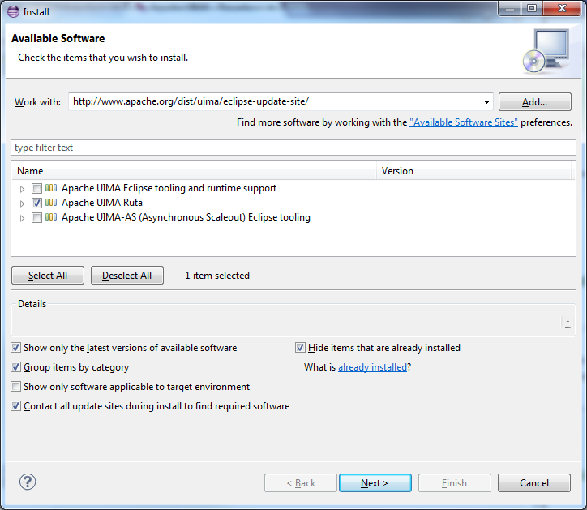

// Licensed to the Apache Software Foundation (ASF) under one
// or more contributor license agreements. See the NOTICE file
// distributed with this work for additional information
// regarding copyright ownership. The ASF licenses this file
// to you under the Apache License, Version 2.0 (the
// "License"); you may not use this file except in compliance
// with the License. You may obtain a copy of the License at
//
// http://www.apache.org/licenses/LICENSE-2.0
//
// Unless required by applicable law or agreed to in writing,
// software distributed under the License is distributed on an
// "AS IS" BASIS, WITHOUT WARRANTIES OR CONDITIONS OF ANY
// KIND, either express or implied. See the License for the
// specific language governing permissions and limitations
// under the License.

[[_section.ugr.tools.ruta.workbench.install]]
= Installation

Do the installation of the UIMA Ruta Workbench as follows: 

. Download, install and start Eclipse. The Eclipse version currently supported by UIMA Ruta is given  on the webpage of the https://uima.apache.org/ruta.html[project]. This is normally the latest version of Eclipse, which can be obtained from the https://eclipse.org/[eclipse.org] download site. 
. Add the Apache UIMA update site ( http://www.apache.org/dist/uima/eclipse-update-site/[http://www.apache.org/dist/uima/eclipse-update-site/ ]) to the available software sites in your Eclipse installation. Click on "`Help -> Install New Software`". This opens the install wizard, which can be seen in <<_figure.ugr.tools.ruta.workbench.install.update>>
. Select or enter the Apache UIMA update site (http://www.apache.org/dist/uima/eclipse-update-site/[http://www.apache.org/dist/uima/eclipse-update-site/ ])in field "`Work with:`" and press "`Enter`". 
. Select "`Apache UIMA Ruta`" and (if not yet installed) "`Apache UIMA Eclipse tooling and runtime support`" by clicking into the related checkbox. 
. Also select "`Contact all update sites during install to find required software `" and click on "`Next`". 
. On the next page, click "`Next`" again. Now, the license agreement site is displayed. To install UIMA Ruta read the license and choose "`I accept the ...`" if you agree to it. Then, click on "`Finish`"

[[_figure.ugr.tools.ruta.workbench.install.update]]
. Eclipse update site 

Now, UIMA Ruta is going to be installed.
After the successful installation, switch to the UIMA Ruta perspective.
To get an overview, see <<_section.ugr.tools.ruta.workbench.overview>>. 

[NOTE]
====
It is sometimes necessary to increase to available PermGenSpace by adding `-XX:PermSize=64M -XX:MaxPermSize=228M` to the config.ini file of your Eclipse installation. 
====

Several times within this chapter we use a UIMA Ruta example project to illustrate the use of the UIMA Ruta Workbench.
The "`ExampleProject`" project is part of the source release of UIMA Ruta (example-projects folder). 

To import this project into the workbench do "`File -> Import... `" . Select "`Existing Projects into Workspace`" under "`General`" . Select the "`ExampleProject`" directory in your file system as root directory and click on "`Finish`" . The example project is now available in your workspace. 