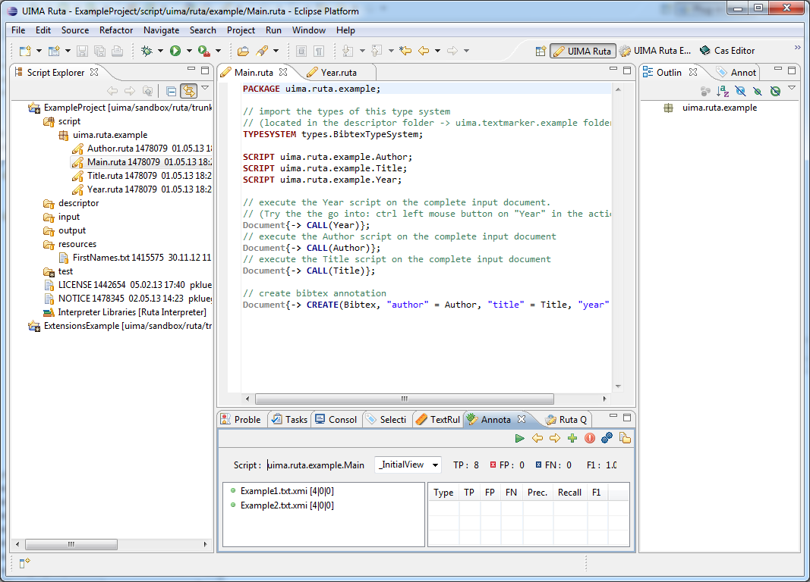

// Licensed to the Apache Software Foundation (ASF) under one
// or more contributor license agreements. See the NOTICE file
// distributed with this work for additional information
// regarding copyright ownership. The ASF licenses this file
// to you under the Apache License, Version 2.0 (the
// "License"); you may not use this file except in compliance
// with the License. You may obtain a copy of the License at
//
// http://www.apache.org/licenses/LICENSE-2.0
//
// Unless required by applicable law or agreed to in writing,
// software distributed under the License is distributed on an
// "AS IS" BASIS, WITHOUT WARRANTIES OR CONDITIONS OF ANY
// KIND, either express or implied. See the License for the
// specific language governing permissions and limitations
// under the License.

[[_section.ugr.tools.ruta.workbench.overview]]
= UIMA Ruta Workbench Overview

The UIMA Ruta Workbench provides two main perspectives. 

. The "`UIMA Ruta perspective`", which provides the main functionality for working on UIMA Ruta projects. See <<_section.ugr.tools.ruta.workbench.ruta_perspective>>. 
. The "`Explain perspective`", which provides functionality primarily used to explain how a set of rules are executed on input documents. See <<_section.ugr.tools.ruta.workbench.explain_perspective>>. 

The following image shows the UIMA Ruta perspective. 

. The UIMA Ruta perspective. 

As you can see, the UIMA Ruta perspective provides an editor for editing documents, e.g., UIMA Ruta scripts, and several views for different other tasks.
The Script Explorer, for example, helps to manage your UIMA Ruta projects. 

The following <<_table.ugr.tools.ruta.workbench.overview.views>> lists all available UIMA Ruta views: 

[[_table.ugr.tools.ruta.workbench.overview.views]]
.UIMA Ruta views
[cols="1,1", frame="all", options="header"]
|===
| View
| Detailed description

| Annotation Test
| See <<_section.ugr.tools.ruta.workbench.testing.usage>>

| Applied Rules
| See <<_section.ugr.tools.ruta.workbench.explain_perspective.applied_rules>>

| Check Annotations
| See <<_section.tools.ruta.workbench.check>>

| Covering Rules
| See <<_section.ugr.tools.ruta.workbench.explain_perspective.covering_rules>>

| Created By
| See <<_section.ugr.tools.ruta.workbench.explain_perspective.created_by>>

| Failed Rules
| See <<_section.ugr.tools.ruta.workbench.explain_perspective.matched_and_failed_rules>>

| False Negative
| See <<_section.ugr.tools.ruta.workbench.testing.usage>>

| False Positive
| See <<_section.ugr.tools.ruta.workbench.testing.usage>>

| Matched Rules
| See <<_figure.ugr.tools.ruta.workbench.explain_perspective.matched_and_failed_rules>>

| Rule Elements
| See <<_section.ugr.tools.ruta.workbench.explain_perspective.rule_elements>>

| Rule List
| See <<_section.ugr.tools.ruta.workbench.explain_perspective.rule_list>>

| Statistics
| See <<_section.ugr.tools.ruta.workbench.explain_perspective.statistics>>

| Ruta Query
| See <<_section.ugr.tools.ruta.workbench.ruta_query>>

| TextRuler
| See <<_section.tools.ruta.workbench.textruler>>

| TextRuler Results
| See <<_section.tools.ruta.workbench.textruler>>

| True Positive
| See <<_section.ugr.tools.ruta.workbench.testing.usage>>
|===

The following <<_table.ugr.tools.ruta.workbench.overview.wizards>> lists all UIMA Ruta wizards: 

[[_table.ugr.tools.ruta.workbench.overview.wizards]]
.UIMA Ruta wizards
[cols="1,1", frame="all", options="header"]
|===
| Wizard
| Detailed description

| Create UIMA Ruta project
| See <<_section.ugr.tools.ruta.workbench.projects.create_projects>>
|===