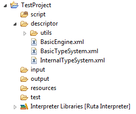
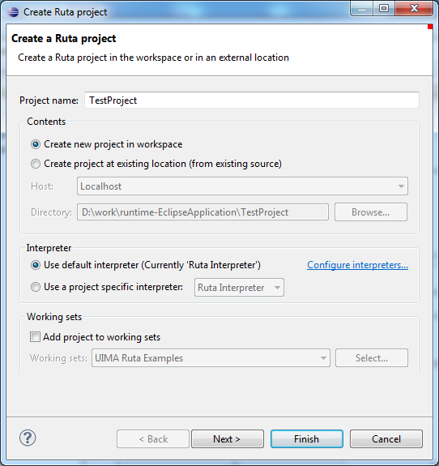

// Licensed to the Apache Software Foundation (ASF) under one
// or more contributor license agreements. See the NOTICE file
// distributed with this work for additional information
// regarding copyright ownership. The ASF licenses this file
// to you under the Apache License, Version 2.0 (the
// "License"); you may not use this file except in compliance
// with the License. You may obtain a copy of the License at
//
// http://www.apache.org/licenses/LICENSE-2.0
//
// Unless required by applicable law or agreed to in writing,
// software distributed under the License is distributed on an
// "AS IS" BASIS, WITHOUT WARRANTIES OR CONDITIONS OF ANY
// KIND, either express or implied. See the License for the
// specific language governing permissions and limitations
// under the License.

[[_section.ugr.tools.ruta.workbench.projects]]
= UIMA Ruta Projects

UIMA Ruta projects used within the UIMA Ruta Workbench need to have a certain folder structure.
The parts of this folder structure are explained in <<_table.ugr.tools.ruta.workbench.create_project.folder_strucutre>>.
To create a UIMA Ruta project it is recommended to use the provided wizard, explained in <<_section.ugr.tools.ruta.workbench.projects.create_projects>>.
If this wizard is used, the required folder structure is automatically created. 

[[_table.ugr.tools.ruta.workbench.create_project.folder_strucutre]]
.Project folder structure
[cols="1,1", frame="all", options="header"]
|===
| Folder
| Description

| `script`
| Source folder for UIMA Ruta scripts and packages. 

| `descriptor`
| Build folder for UIMA components. Analysis engines and type systems are created automatically from the related script files. 

| `input`
| Folder that contains the files that will be processed when launching a UIMA Ruta script. Such input files could be plain text, HTML or xmiCAS files. 

| `output`
| Folder that contains the resulting xmiCAS files. One xmiCAS file is generated for each associated document in the input folder. 

| `resources`
| Default folder for word lists, dictionaries and tables. 

| `test`
| Folder for test-driven development. 
|===

<<_figure.ugr.tools.ruta.workbench.projects.test_project>> shows a project, newly created with the wizard. 

[[_figure.ugr.tools.ruta.workbench.projects.test_project]]
.A newly created UIMA Ruta project

[[_section.ugr.tools.ruta.workbench.projects.create_projects]]
== UIMA Ruta create project wizard

To create a new UIMA Ruta project, switch to UIMA Ruta perspective and click "`File -> New -> UIMA Ruta Project`".
This opens the corresponding wizard. 

<<_figure.ugr.tools.ruta.workbench.projects.create_projects.wizard1>> shows the start page of the wizard. 

[[_figure.ugr.tools.ruta.workbench.projects.create_projects.wizard1]]
.Wizard start page

To create a simple UIMA Ruta project, enter a project name for your project and click "`Finish`".
This will create everything you need to start. 

Other possible settings on this page are the desired location of the project, the interpreter to use and the working set you wish to work on, all of them are self-explaining. 

<<_figure.ugr.tools.ruta.workbench.projects.create_projects.wizard2>> shows the second page of the wizard. 

[[_figure.ugr.tools.ruta.workbench.projects.create_projects.wizard2]]
.Wizard second page
image::images/tools/ruta/workbench/projects/wizard2.PNG[Wizard second page.]
