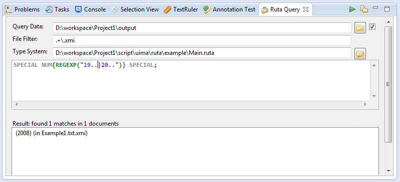

// Licensed to the Apache Software Foundation (ASF) under one
// or more contributor license agreements. See the NOTICE file
// distributed with this work for additional information
// regarding copyright ownership. The ASF licenses this file
// to you under the Apache License, Version 2.0 (the
// "License"); you may not use this file except in compliance
// with the License. You may obtain a copy of the License at
//
// http://www.apache.org/licenses/LICENSE-2.0
//
// Unless required by applicable law or agreed to in writing,
// software distributed under the License is distributed on an
// "AS IS" BASIS, WITHOUT WARRANTIES OR CONDITIONS OF ANY
// KIND, either express or implied. See the License for the
// specific language governing permissions and limitations
// under the License.

[[_section.ugr.tools.ruta.workbench.ruta_query]]
= Ruta Query View

With the Query View, the UIMA Ruta language can be used to write queries on a set of documents.
A query is simply a set of UIMA Ruta rules.
Each query returns a list of all text passages the query applies to.
For example, if you have a set of annotated documents containing a number of Author annotations, you could use the Query View to get a list of all the author names associated with these annotations.
The set of relevant files can be restricted by a regular expression over the file names, e.g., "files_0[0-9]\\.xmi". 

.The Query View. *(1)*Start Button; *(2)*Export Button

Use the Query view as follows: 

. The field "`Query Data`" specifies the folder containing the documents on which the query should be executed. You can either click on the button next to the field to specify the folder by browsing through the file system or you can drag and drop a folder directly into the field. If the checkbox is activated, all subfolders are included. 
. The field "`Type System`" has to contain a type system or a UIMA Ruta script that specifies all types that are used in the query. You can either click on the button next to the field to specify the type system by browsing through the file system or you can drag and drop a type system directly into the field. 
. The query in form of one or more UIMA Ruta rules is specified in the text field in the middle of the view.
. After pressing the start button, the query is started. The results are subsequently displayed in the bottom text field.

The resulting list consists of all text passages the query applied to.
Above the text field, information about the entire number of matches and the number of different documents the query applied to is given.
Each item in the list shows both the matched text passage and in brackets the document related to the text passage.
By double-clicking on one of the listed items, the related document is opened in the editor and the matched text passage is selected.
If the related document is already open you can jump to another matched text passage within the the same document with one click on the listed item.
Of course, this text passage is selected.
By clicking on the export button, a list of all matched text passaged is showed in a separate window.
For further usage, e.g.
as a list of authors in another UIMA Ruta project, copy the content of this window to another text file. 

The screenshot shows an example where a rule is used to find occurrences of years within brackets in the input file of the UIMA Ruta example.
After pressing the run button the result list contains all occurrences.
Recognize that the rule does not create any annotation.
The list lists all rule matches, not the created annotations. 