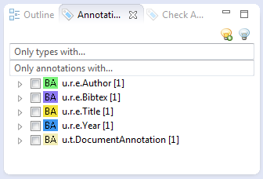

// Licensed to the Apache Software Foundation (ASF) under one
// or more contributor license agreements. See the NOTICE file
// distributed with this work for additional information
// regarding copyright ownership. The ASF licenses this file
// to you under the Apache License, Version 2.0 (the
// "License"); you may not use this file except in compliance
// with the License. You may obtain a copy of the License at
//
// http://www.apache.org/licenses/LICENSE-2.0
//
// Unless required by applicable law or agreed to in writing,
// software distributed under the License is distributed on an
// "AS IS" BASIS, WITHOUT WARRANTIES OR CONDITIONS OF ANY
// KIND, either express or implied. See the License for the
// specific language governing permissions and limitations
// under the License.

[[_section.ugr.tools.ruta.workbench.ruta_perspective]]
= UIMA Ruta Perspective

The UIMA Ruta perspective is the main view to manage UIMA Ruta projects.
There are several views associated with the UIMA Ruta perspective: Annotation Test, Annotation Browser, Selection, TextRuler and Ruta Query.
Since Annotation Test, TextRuler and Ruta Query have a stand-alone functionality.
They are explained in separate sections. 

To make it possible to reproduce all of the examples used below, switch to the UIMA Ruta Explain perspective within your Eclipse workbench.
Import the UIMA Ruta example project and open the main UIMA Ruta script file 'Main.ruta'. Now press the 'Run' button (green arrow) and wait for the end of execution.
Open the resulting xmiCAS file 'Test1.txt.xmi', which you can find in the output folder. 

[[_section.ugr.tools.ruta.workbench.ruta_perspective.annotation_browser]]
== Annotation Browser

The Annotation Browser can be used to view the annotations created by the execution of a UIMA Ruta project.
If an xmiCAS file is opened and active in the editor, the related annotations are shown in this view. 

The result of the execution of the UIMA Ruta example project is shown in <<_figure.ugr.tools.ruta.workbench.ruta_perspective.annotation_browser>>.
You can see that there are 5 annotations of 5 different types in the document.
Highlighting of certain types can be controlled by the checkboxes in the tree view.
The names of the types are abbreviated by their package constituents.
Full type names are provided by tooltips and can be copied into the clipboard by hitting 'ctrl + c'.  This can be especially useful to paste a type name into the Query View. 

[[_figure.ugr.tools.ruta.workbench.ruta_perspective.annotation_browser]]
.Annotation Browser view 

Moreover, this view has two possible filters.
Using the "`Only types with...`"-filter leads to a list containing only those types that contain the entered text.
The "`Only annotations with...`"-filter leads to an analogous list.
Both list filters can be quickly activated by hitting the return key. 

Type highlighting can be reset by the action represented by a switched-off light bulb at the top of the view.
The light bulb that is turned on sets all types visible in the tree view of the page highlighted in the CAS editor. 

The offsets of selected annotations can be modified with ctrl + u (reduce begin), ctrl + i (increase begin), ctrl + o (reduce end), and ctrl + p (increase end). 

The user can choose whether parent types are displayed using the preference page "`UIMA Cas Editor -> Cas Editor Views`". 

[[_section.ugr.tools.ruta.workbench.ruta_perspective.selection]]
== Selection

The Selection view is very similar to the Annotation Browser view, but only shows annotations that affect a specific text passage.
To get such a list, click on any position in the opened xmiCAS document or select a certain text passage. 

If you select the text passage ``2008``, the Selection view will be generated as shown in <<_figure.ugr.tools.ruta.workbench.ruta_perspective.selection>>. 

[[_figure.ugr.tools.ruta.workbench.ruta_perspective.selection]]
.Selection view 
image::images/tools/ruta/workbench/ruta/selection.png[Selection view.]

The Selection view has the same filtering and modification options as described in Annotation Browser view. 