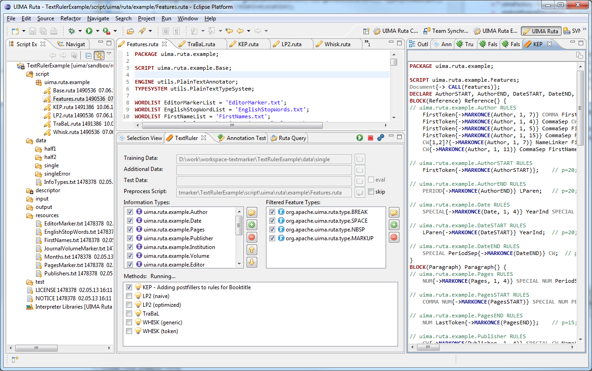
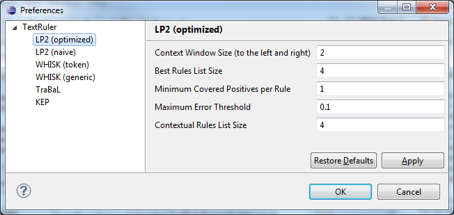

// Licensed to the Apache Software Foundation (ASF) under one
// or more contributor license agreements. See the NOTICE file
// distributed with this work for additional information
// regarding copyright ownership. The ASF licenses this file
// to you under the Apache License, Version 2.0 (the
// "License"); you may not use this file except in compliance
// with the License. You may obtain a copy of the License at
//
// http://www.apache.org/licenses/LICENSE-2.0
//
// Unless required by applicable law or agreed to in writing,
// software distributed under the License is distributed on an
// "AS IS" BASIS, WITHOUT WARRANTIES OR CONDITIONS OF ANY
// KIND, either express or implied. See the License for the
// specific language governing permissions and limitations
// under the License.

[[_section.tools.ruta.workbench.textruler]]
= TextRuler

Apache UIMA Ruta TextRuler is a framework for supervised rule induction included in the UIMA Ruta Workbench.
It provides several configurable algorithms, which are able to learn new rules based on given labeled data.
The framework was created in order to support the user by suggesting new rules for the given task.
The user selects a suitable learning algorithm and adapts its configuration parameters.
Furthermore,  the user engineers a set of annotation-based features, which enable the algorithms to form efficient, effective and comprehensive rules.
The rule learning algorithms present their suggested rules in a new view, in which the user can either copy  the complete script or single rules to a new script file, where the rules can be further refined. 

This section gives a short introduction about the included features and learners, and how to use the framework to learn UIMA Ruta rules.
First, the  available rule learning algorithms are introduced in <<_section.tools.ruta.workbench.textruler.learner>>.
Then,  the user interface and the usage is explained in <<_section.tools.ruta.workbench.textruler.ui>> and <<_section.tools.ruta.workbench.textruler.example>> illustrates the usage with an exemplary UIMA Ruta project. 

[[_section.tools.ruta.workbench.textruler.learner]]
== Included rule learning algorithms

This section gives a short description of the rule learning algorithms, which are provided in the UIMA Ruta TextRuler framework. 

[[_section.tools.ruta.workbench.textruler.lp2]]
=== LP2

[NOTE]
====
This rule learner is an experimental implementation of the ideas and algorithms published in: F.
Ciravegna.
(LP)2, Rule Induction for Information Extraction Using Linguistic Constraints.
Technical Report CS-03-07, Department of Computer Science, University of Sheffield, Sheffield, 2003. 
====

This algorithms learns separate rules for the beginning and the end of a single slot, which are later combined  in order to identify the targeted annotation.
The learning strategy is a bottom-up covering algorithm.
It starts by creating a specific seed instance with a window of w tokens to the left and right of the target boundary and searches for the best generalization.
Additional context rules are induced in order to identify missing boundaries.
The current implementation does not support correction rules.
The TextRuler framework provides two versions of this algorithm: LP2 (naive) is a straightforward implementation with limited expressiveness concerning the resulting Ruta rules.
LP2 (optimized) is an improved  version with a dynamic programming approach and is providing better results in general.
The following parameters are available.
For a more detailed description of the parameters,  please refer to the implementation and the publication. 

* Context Window Size (to the left and right)
* Best Rules List Size
* Minimum Covered Positives per Rule
* Maximum Error Threshold
* Contextual Rules List Size

[[_section.tools.ruta.workbench.textruler.whisk]]
=== WHISK

[NOTE]
====
This rule learner is an experimental implementation of the ideas and algorithms published in: Stephen Soderland, Claire Cardie, and Raymond Mooney.
Learning Information Extraction Rules for Semi-Structured and Free Text.
In Machine Learning, volume 34, pages 233-272, 1999. 
====

WHISK is a multi-slot method that operates on all three kinds of documents and learns single- or multi-slot rules looking similar to regular expressions.
However, the current implementation only support single slot rules.
The top-down covering algorithm begins with the most general rule and specializes it by adding single rule terms until the rule does not make errors anymore on the training set.
The TextRuler framework provides two versions of this algorithm: WHISK (token) is a naive token-based implementation.
WHISK (generic) is an optimized and improved implementation,  which is able to refer to arbitrary annotations and also supports primitive features.
The following parameters are available.
For a more detailed description of the parameters,  please refer to the implementation and the publication. 

* Parameters Window Size
* Maximum Error Threshold
* PosTag Root Type
* Considered Features (comma-separated) - only WHISK (generic)

[[_section.tools.ruta.workbench.textruler.trabal]]
=== TraBaL

[NOTE]
====
This rule learner is an implementation of the ideas and algorithms published in: Benjamin Eckstein, Peter Kluegl, and Frank Puppe.
Towards Learning Error-Driven  Transformations for Information Extraction.
Workshop Notes of the LWA 2011 -  Learning, Knowledge, Adaptation, 2011. 
====

The TraBal rule learner induces rules that try to correct annotations error and relies on two set of documents.
A set of  documents with gold standard annotation and an additional set of annotated documents with the same text that possibly contain erroneous annotations, for which correction rules should be learnt.
First, the algorithm compares the two sets of documents and  identifies the present errors.
Then, rules for each error are induced and extended.
This process can be iterated in order  to incrementally remove all errors.
The following parameters are available.
For a more detailed description of the parameters,  please refer to the implementation and the publication. 

* Number of times, the algorithm iterates.
* Number of basic rules to be created for one example.
* Number of optimized rules to be created for one example.
* Maximum number of iterations, when optimizing rules.
* Maximum allowed error rate.
* Correct features in rules and conditions. (not yet available)

[[_section.tools.ruta.workbench.textruler.kep]]
=== KEP

The name of the rule learner KEP (knowledge engineering patterns) is derived from the idea that humans use different engineering patterns  to write annotation rules.
This algorithms implements simple rule induction methods for some patterns, such as boundary detection  or annotation-based restriction of the window.
The results are then combined in order to take advantage of the combination of  the different kinds of induced rules.
Since the single rules are constructed according to how humans engineer the annotations rules,  the resulting rule set should resemble more a handcrafted rule set.
Furthermore, by exploiting the synergy of the patterns, solutions for  some annotation are much simpler.
The following parameters are available.
For a more detailed description of the parameters,  please refer to the implementation. 

* Maximum number of "`Expand Rules`"
* Maximum number of "`Infiller Rules`"

[[_section.tools.ruta.workbench.textruler.ui]]
== The TextRuler view

The TextRuler view is normally located in the lower center of the UIMA Ruta perspective and is the main user interface to configure and start the rule learning algorithms.
The view consists of four parts (cf. <<_figure.tools.ruta.workbench.textruler.main>>):  The toolbar contains buttons for starting (green button) and stopping (red button) the learning process,  and one button that opening the preference page (blue gears) for configuring the rule induction algorithms cf. <<_figure.tools.ruta.workbench.textruler.pref>>.
The upper part of the view contains text fields for defining the set of utilized documents. "`Training Data`" points to the absolute location of the folder containing the gold standard documents. "`Additional Data`" points to the absolute location of documents that can be additionally used by the algorithms.
These documents are currently only needed by the TraBal algorithm, which tries to learn correction rules for the error in those documents. "`Test Data`" is not yet available.
Finally, "`Preprocess Script`" points to the absolute location of a UIMA Ruta script, which contains all necessary types and can be applied on the documents before the algorithms start in order to add additional annotations as learning features.
The preprocessing can be skipped.
All text fields support drag and drop: the user can drag a file in the script explorer and drop it in the respective text field.
In the center of the view, the target types, for which rule should be induced, can be specified in the "`Information Types`" list.
The list "`Featured Feature Types`" specify the filtering settings, but it is discourage to change these settings.
The user is able to drop a simple text file, which contains a type with complete namespace in each line, to the "`Information Types`" list in order to add all those types.
The lower part of the view contains the list of available algorithms.
All checked algorithms will be started, if the start button in the toolbar of the view is pressed.
When the algorithms are started, they display their current action after their name, and a result view with the currently induced rules is displayed  in the right part of the perspective. 

[[_figure.tools.ruta.workbench.textruler.main]]
.The UIMA Ruta TextRuler framework 

[[_figure.tools.ruta.workbench.textruler.pref]]
.The UIMA Ruta TextRuler Preferences 

